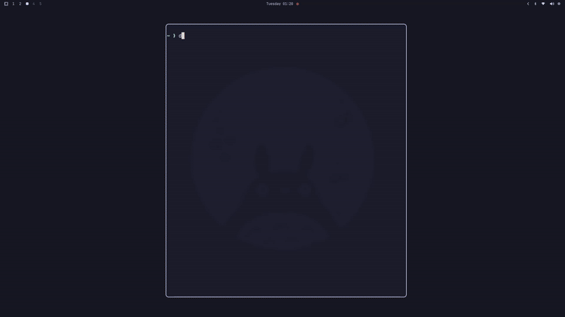

# Decibelle 🎧

<div align="center">
  
</div>

A minimal terminal-based audiobook player for [Audiobookshelf](https://www.audiobookshelf.org/).

## Setup

### 1. Audiobookshelf Server

Run Audiobookshelf with Docker:

```bash
docker run -d \
  -p 13378:80 \
  -v /path/to/audiobooks:/audiobooks \
  -v /path/to/config:/config \
  -v /path/to/metadata:/metadata \
  --name audiobookshelf \
  ghcr.io/advplyr/audiobookshelf:latest
```

Access the web interface at `http://localhost:13378` and complete the initial setup.

### 2. API Key

1. Open Audiobookshelf web interface
2. Go to **Settings** → **API Keys** → **Add API Key**
3. Copy the generated token

### 3. Configuration

On first run, Decibelle creates a config file at `~/.config/decibelle/config.yml`:

```yaml
server_url: http://localhost:13378
api_key: your_api_key_here
theme: catppuccin_mocha  # tokyo_night, gruvbox, kanagawa, hackerman
image_protocol: auto     # sixel, kitty, iterm2, halfblocks
```

Edit this file with your server URL and API key.

## Running

```bash
cargo run --release
```

## Controls

- `↑↓` / `jk` - Navigate lists
- `←→` / `hl` - Navigate panels / Seek ±5s
- `L` / `H` - Switch library
- `Enter` - Select / Play
- `Space` - Play/Pause
- `n` - Toggle time display
- `Tab` - Cycle focus
- `q` - Quit
